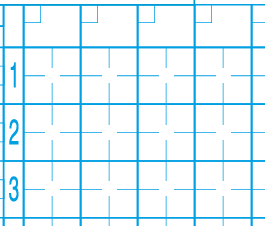
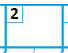
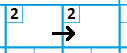
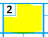

`2.4`

# Centrální část

Kolonka zápisu reprezentuje start daného pálkaře (řádek) v dané směně (sloupec). Využijí se pochopitelně jen ty, kdy ke startu skutečně došlo, a celá řada jich v průběhu každého zápasu zůstane prázdná.

Za kolonkou posledního hráče v ukončené směně se udělá čára, která vizuálně oddělí jednu směnu od druhé (OBR). Pozor, že poslední pálkař nemusí být ten, který byl poslední aut. A rovněž pozor, že naopak pálkař v boxu nemusí ukončit svůj start, je-li vyautován někdo na metách. V tom případě se mu z dosavadního působení nezapíše nic, směna je ukončena jeho předchůdcem a v následující směně nastupuje jako první pálkař. 

V následující směně se pokračuje o sloupec vedle od dalšího pálkaře. Dojde-li se k poslednímu pálkaři a směna ještě není u konce, pokračuje se od prvního nahoře ve stejném sloupci. Teprve, pokud se v jedné směně otočí celé pálkařské pořadí a jeden pálkař nastupuje podruhé, přejde se do vedlejšího sloupce. 

Pokračování se do zápisu naznačí šipkou (OBR) a rovněž se vyznačí v záhlaví sloupce (OBR).

Číslo směny se píše do malého čtverečku vlevo nahoře:

 
Protože není předem jasné, kolik pálkařů se za směnu vystřídá, nejsou předtištěné. Pokud jde ve směně více než 9 pálkařů, zápis „přeteče“ do dalšího sloupce, což se zdůrazní šipkou:

 
## Postupy a auty

Kolonku zápisu je tvořena čtvercem a navzájem kolmými tenčími čárkami, které tvoří jakýsi „zaměřovací kříž“. Jeho ramena představují jednotlivé mety. Orientován je tak, jako by se zapisovatel a pozdější čtenáři na hru dívali zpoza backstopu. Domácí meta je tedy dole, první následuje vpravo, druhá nahoře a třetí vlevo[^1].

Úspěšné postupy běžců se vizualizují spojením vrcholů (OBR). Spojí-li se všechny čtyři, běžec dosáhl bodu pro svůj tým.

Situace, která skončila autem, se dává do kroužku. Z počtu kroužků v zápisu je kdykoliv ihned vidět počet autů ve směně a rovněž se s jejich pomocí snadněji zpětně dohledávají auty a asistence do polařských statistik.

## Střídání

Prázdný prostor v záhlaví sloupce může být použit k zachycení informací o střídání:

 
To však bude detailně probíráno až v kapitole 5.

---

[^1] Někteří naši zapisovatelé ze softbalového prostředí budou možná zvyklí na starší systém, který se v některých klubech stále ústní tradicí dědí, a krom dalších podstatných odlišností posouvá zobrazovací logiku o devadesát stupňů doleva - první meta je vpravo nahoře, domácí vpravo dole.
