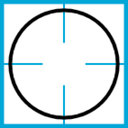
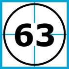
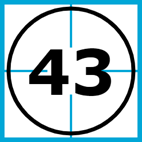
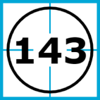
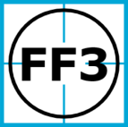
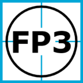
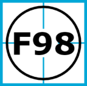

`3.2`

# Auty pálkařů před 1. metou

Ideální situací pro obranu a rovněž pro zapisovatele je, když se pálkař vůbec nedostane do hry, resp. neobsadí ani první metu a po svém startu na pálce odchází zpět do dugoutu svého týmu.

Jelikož není třeba značit žádný postup po metách, je pro zápis autu možné využít celou kolonku. Konkrétní situace bude zapsána uvnitř velkého kroužku:

 
## Ground out

Jednou z nejčastějších a zároveň nejsnáze zapsatelných situací je odpal po zemi do vnitřního pole, který zpracuje nejbližší polař a přihazuje směrem k první metě, kde je běžící pálkař autován buďto zašlápnutím mety nebo méně často tečováním.

Odkaz na pravidla

Zápis je pro obě situace stejný - pozice hráče v obraně, který přihrával, následovaná pozicí spoluhráče, který zahrál aut. Mezi čísly se správně nedělá pomlčka, byť ji řada zapisovatelů ze zvyku používá a faktickou chybou zhoršující čitelnost zápisu to není[^1].

     
Nejčastěji přihrávají vnitřní polaři (2B, 3B a SS) či nadhazovač (P) potažmo catcher (C) na první metu (1B). V baseballu není až tak neobvyklé, že první metař jde pro míč daleko dopředu a na metě ho zastoupí nadhazovač. Někdy aut zahraje i hráč na druhé metě. Při kombinaci rychlého odpalu, dobrého příhozu a pomalejšího běžce je občas možné stihnout příhoz z vnějšího pole, nejčastěji z pravého (RF).

 
Patří sem i varianta, kdy k přihrávce nedochází, a polař rovnou sám šlape metu nebo tečuje běžícího pálkaře. Tu obvykle vídáme u první mety:

 
Vzácněji je k vidění situace krátkého odpalu do blízkosti domácí mety, který zpracuje catcher a doběhne pomalejšího nebo pozdě reagujícího pálkaře. Nic nebrání ani dalším kurioznějším situacím.

Je možný i větší počet asistencí. Teoreticky jich může být libovolný počet, prakticky se setkáváme max. se dvěma. Typickou situací, kterou zapisovatel posoudí jako dvojitou asistenci, je teč polaře, která změní směr odpáleného míče natolik, že se k němu dostane jeho kolega, který jej teprve úspěšně zpracuje a včas přihodí. V tomto případě nerozhoduje, že tato první přihrávka obvykle nebývá vědomá, nýbrž jde pouze o reflexivní pokus chytit míč, či dokonce o nedokonalost zpracování. Předpokladem je taková změna směru odpalu, která usnadní práci druhému z polařů.

 
VID 3-4-3

##  Flyout

Další běžnou situací je chycení odpáleného míče polařem přímo ze vzduchu.

Odkaz na pravidla

Zde je na zapisovateli, aby rozhodl, o jaký typ letícího míče šlo. Na výběr má ze tří variant zápisu:

- „Fly ball“ - „běžný“ luft, o kterém nelze říct nic zvláštního - značí se písmenem F 
- „Line drive“ - přímý odpal, který letí nízko a v podstatě rovně - značí se písmenem L
- „Pop up“ - velmi vysoký odpal, který dlouho padá a polař na něj čeká - značí se písmenem P

Po písmenu, které určuje typ, následuje pozice polaře, který zahrál aut:

         
Mezi zapisovateli nepanuje jasná shoda na výkladu pravidel pro aplikaci té které situace. Často jsou slyšet spory, jestli psát ještě „fly“, nebo už to byl „pop up“, či zda byl odpal dostatečně přímý, aby si zasloužil označení „line drive“. Někteří uplatňují názor, že v zadním poli je každopádně všechno „fly“, další včetně mě s tím nesouhlasí. Každopádně finální rozhodnutí o konkrétní rozehře bude vždy na vás a vašem úsudku. 

Dobrá zpráva ovšem je, že z hlediska statistik jsou všechny tři možnosti rovnocenné. Důvodem, proč vůbec existují odděleně, je obecná snaha zapisovatelů zahrnout do zápisu maximum informací. Člověk, který zápis později čte, si tak může hru o něco lépe představit.

V podstatě ze stejného důvodu rozeznáváme speciální případy, kdy je míč ze vzduchu chycen mimo čtvrtkruh vymezující hřiště, tj. v zámezí („ve foul ballu“). V takovém případě se na začátek přidá ještě jedno F jako „foul“. Opět je možné blíže specifikovat tvar dráhy odpalu:

         
Často je místo chycení odpalu zjevné a rozhodnutí zda „fair či foul“ zvládnete udělat sami, ať už hru sledujete odkudkoliv. Některé situace jsou ale těsné a pohled ze strany může zkreslovat. V takových chvílích vám může pomoct hlavní rozhodčí, který chycení vyhlašuje. Pokud je dostatečně zkušený, tak si jednak naběhne tak, aby stál přímo na čáře a viděl jednoznačně, na které straně se nachází rukavice chytajícího polaře, ale navíc to ještě po vyhlášení gesta pro aut rukou ukáže - buďto do hřiště nebo ven. Pamatujte na to, a když na to dojde, tak rozhodčího po očku sledujte. V nejhorším zrovna neukáže nic a vy to budete muset odhadnout sami. 

Nebývá to příliš časté, ale i v tomto případě lze dosáhnout (neúmyslné) asistence. Hráči se při chytání odpalu vždycky snaží jeden druhého „zaběhnout“, aby mohli co nejrychleji napravit kolegovo případné zaváhání. A tak se občas povede, že chytající si míč pouze nadrazí někam nad sebe, a když má jeho spoluhráč dostatečný postřeh a trochu štěstí, podaří se aut zahrát jemu. Jelikož se míč stále nedotkl země, platí pravidlo o chycení ze vzduchu. A jelikož teč k výsledku rozehry chtě nechtě přispěla, počítá se jako asistence. Zápis pak může vypadat třeba takto:

 
## Strikeout

Ideálním výsledkem pro obranu, ale hlavně pro nadhazovače, je vyřazení pálkaře, aniž by kontaktoval míč a uvedl ho svým odpalem do hry.

Odkaz na pravidla

Zapisovatelským symbolem pro tuto situaci je písmeno K. Pokud by vás zajímalo, proč tomu tak je vězte, že to má na svědomí novinář Henry Chadwick, velký průkopník propagace baseballu a také „vynálezce“ některých dnes už zcela základních statistik. Konkrétní důvod je velmi prostý - jiná písmenka už obsadil jinými statistikami, takže mu na strikeout velké K zkrátka zbylo. To bylo v 60. letech 19. století, pár let po americké občanské válce, ale už nám to tak zůstalo.

Rozeznáváme dvě základní varianty - prošvihnutý (swinging) a vyhlášený[^2] (looking). Rozdíl logicky spočívá v činnosti pálkaře - zda míč nechává proletět v domnění, že jde o ball, nebo zda se pokouší švihnout a míjí. 

V některých méně jasných situacích je dobré sledovat gestikulaci rozhodčího. Pokud ukáže rukou na pálkaře, hodnotí jeho pohyb jako švih (swing). Vyhlášený strikeout looking obvykle hlavní rozhodčí vyhlašuje nápadně nahlas a situaci doprovází výrazným gestem „trhání“ (pálkařských ambicí dotyčného). Občas není situace se švihem jasná a v té chvíli se hlavní rozhodčí může obrátit na kolegu na metě (většinou se tak děje po reklamaci týmu v obraně). Ten pak buďto rozpaží, takže nadhoz zůstává jako ball, nebo zdvihne pravou ruku v gestu pro swinging strikeout. Swinging je rovněž chycený třetí foul tip (lehké tečování míče přímo do rukavice catchera), což rozhodčí ukáže přejetím prsty pravé ruky do strany po hřbetě levé ruky. Pokud míč vystoupá nad ramena catchera, a ten jej následně chytí, už nejde o strikeout, ale o flyout.

Základní dva strikeouty se v zápise značí následovně:

     
Malé číslo vpravo dole slouží k počítání strikeoutů dosažených aktuálním nadhazovačem, což má poté usnadňovat vyhodnocování. Nezapomínejte, že po každém střídání nadhazovače je nutné toto počítadlo „resetovat“ a počítat znovu od jedné.

Pokud se stane, že catcher třetí strike neudrží, může stále realizovat aut, pokud míč sebere a pálkaře sám tečuje, nebo včas a přesně přihodí na první metu, kterou obraně stačí zašlápnout. Zápis těchto dvou situací je kombinací symbolů pro strikeout a základní ground out:

     
Výčet možností, co se může po strikeoutu stát, tímto zdaleka nekončí, ovšem další varianty už plnou z chyb v obranné hře a jejich výsledkem je obsazená (nejméně) první meta, pročež jejich výklad prozatím odložím, než probereme pojmy potřebné k jejich poskládání.

## Shrnutí

Zatím jsme poznali pouhé tři zapisovatelské situace. Tím už ovšem rázem máme pokrytou dobrou třetinu, možná i polovinu veškerého dění v zápasech, které budete zapisovat. Zažil jsem i třeba i zápas, kde bylo na jedné straně patnáct a na druhé osmnáct strikeoutů. To se pak zapisuje jedna báseň.

Samozřejmě bychom si se znalostí pouze těchto typů rozeher nevystačili. Je i spousta dalších druhů autů - například běžců na metách. Než ale začneme běžce autovat, musíme hráče z útočícího družstva do hry napřed nějak dostat. Proto si v další kapitole probereme typické situace, kterými se pálkař (a posléze běžící pálkař  ) stává běžcem.

--- 

[^1]: Praktickým důvodem, proč pomlčky vynechávat, je úspora místa. U jednoduchých rozeher to nehraje až takovou roli, ale postupně se ukáže, kdy je to výhodné či dokonce nezbytné. Je proto dobré držet se jednotného formátu hned od začátku.
[^2]: Naší hantýrkou též familierně _„prokoukaný“_
