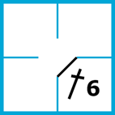
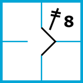
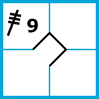
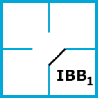

`3.3`

# Obsazení mety pálkařem

## Odpal (hit)

_Pravidlo: Každý hráč baseballu/softballu se zajímá o své statistiky, a kdo říká, že ne, zajímá se o to víc._

A nejdůležitější ze všech statistik je pálkařský průměr (BA). Každý by chtěl nejradši odpálit pokaždé, když jde na pálku. To se ale většinou nepovede. BA tak značí poměr úspěšných odpalů ku počtu startů (některá vystoupení v boxu se jako start nepočítají, ale to teď není důležité). V praxi se nejlepší hráči v MLB pohybují kolem .320 až 0.360[^1], u nás se hráči baseballové extraligy dostávají i přes .400[^2], samozřejmě při menších počtech nadhozů a proti přeci jen méně kvalitním nadhazovačům.

Každopádně je odpal jednou z nejběžnějších situací, která bude v zápase téměř zaručeně k vidění, protože odházet „no-hitter“, tj. kompletní zápas bez jediného odpalu, je pro nadhazovače velká prestiž, která se dá i v MLB každoročně spočítat na prstech REF?.
Jak tedy na zápis odpalu?

K zaznamenání hitu slouží speciální symbol, který nejvíc připomíná „lomítko“ přeškrtnutý tolika krátkými vodorovnými čárkami, kolika met daným odpalem pálkař získal. Slyšel jsem už i výraz „hrobeček“, ale s tím by asi souhlasili převážně nadhazovači. Druhou částí zápisu odpalu je určení místa na hřišti, kam míč po odpalu směřoval. V základu si lze vystačit s čísly pozic v obraně (1-9). Myšlen tím je prostor, kde obvykle daný polař působí, nikoliv nutně ten hráč, který se k odpálenému míči první dostane. Zápisy tedy mohou vypadat třeba takto:

         
Jedinou výjimku má home run, tedy odpal „za plot“, po kterém pálkař rovnou oběhne všechny 4 mety a získá bod U něj se používá zkratka HR a nikoliv „lomítko“ se čtyřmi čarami. Asi by jich už bylo moc. Na to pozor, už jsem to v zápisech také našel. Správný způsob zápisu je tento:

 
## Meta zdarma (BB/HP)

Pokud nadhazovač 4x hodí špatný nadhoz (mimo strikezónu a pálkař se nepokouší odpálit), přichází meta zdarma (BB - base on balls), po které pálkař bez boje získává a obsazuje první metu. Aktuálnímu nadhazovači se mety zdarma počítají a číslují obdobně jako v případě strikeoutů. Číslo se píše jako dolní index vpravo dole.

 
Taktická varianta obrany může být úmyslná meta zdarma (IBB - intentional base-on-balls). Buďto se obrana „bojí“ kvalit pálkaře, nebo si chce ulehčit hru možností nucených autů zašlápnutím mety. Tyto záměry občas vyjdou a jindy se vymstí - viděl jsem například naplnit mety dvěma IBB a poté přišlo třetí BB od nadhazovače a prohra v zápase. Před pár lety se dokonce stalo, že jeden tým v české extralize softballu úmyslně prohrál zápas, který rozhodoval o nasazení do play-off, prostřednictvím udělení asi sedmi IBB v řadě… 

Dříve bylo v baseballu nutné fyzicky „obhazovat“, což občas vedlo k chybám, zahozeným míčům či nečekaným odpalům, dnes už stačí v obou sportech záměr pouze oznámit rozhodčímu a ten pálkaře pošle na první metu „bez boje“. Situace může přijít kdykoliv v průběhu startu - může to být reakce na posun běžců nebo na nepříznivý stav nadhozů.

IBB je zároveň BB, pročež se počítá dohromady s těmi obyčejnými, nečísluje se zvlášť.
 

## Trefení nadhozem (HP)

Občas dost bolestivou variantou, jak obsadit metu, je trefení nadhozem (HP - hit by pitch). Pálkaři nosí helmy a řada z nich i různé chrániče na ruce a nohy, aby snížila riziko zranění při takové situaci, přesto se to občas nepovede. Zažil jsem zápas, kde trefení prudkým nadhozem do hlavy kamsi na rozhraní helmy a tváře utkání jednak ukončilo, jelikož nuceným posunem vznikl vítězný bod, ale také pálkaře poslalo na výlet sanitkou do nemocnice…

Někdy dochází ke sporným situacím, zda byly skutečně trefeny prsty ruky nebo pálka, popř. zda k trefení došlo mimo strikezónu - aby šlo o HP, musí být nadhoz ball a pálkař se nesmí pokoušet o odpal. Pokud se nahne do zóny, bude nadhoz vyhlášen jako strike. Stejně tak, pokud jde do švihu. A v případě trefení při třetím striku jde automaticky o strikeout. To vše naštěstí neposuzuje zapisovatel, ale rozhodčí. My jen musíme sledovat, co bylo nebo nebylo vyhlášeno.

HP se na rozdíl od BB nečísluje. Zdůvodnění mi není zcela zřejmé - buďto, že těchto situací je méně než met zdarma, ale slyšel jsem i, že by to bylo zbytečně neuctivé k nadhazovačům s menší kontrolou zóny.

---

[^1]: Viz [https://www.baseball-reference.com/leaders/batting_avg_leagues.shtml](https://www.baseball-reference.com/leaders/batting_avg_leagues.shtml)
[^2]: 2021 - Michal Ondráček 0.449 - 40 hitů z 89 startů.
